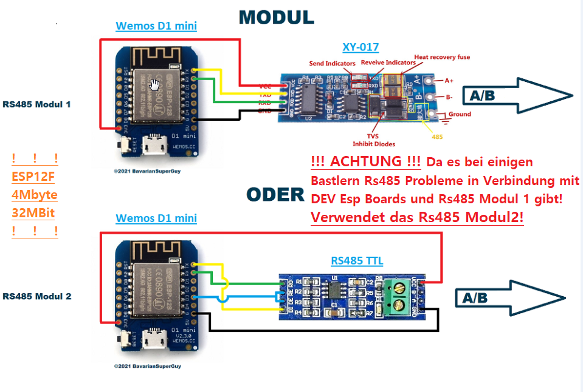
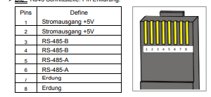

# EspEpeverController mit Webseite 
Esp8266 подключен к контроллеру заряда Epever Solar через модуль Rs485 и может считывать с него доступные данные, а также включать и выключать индикатор загрузки.

Прошивка(firmware_vX.X.X.X.bin") находится в каталоге esplasher.

Что может сделать контроллер ESP8266 Epever :

- Мигающий заголовок на веб-странице является символом -  все в порядке
- Он может выключать и включать реле  нагрузки.
- Отображение всех доступных данных индикатора на веб-странице
- Передача с помощью Mqtt всех доступных данных трассировки в виде массива Json
- Передача через веб-интерфейс всех доступных данных трассировки в виде массива Json
- Отображение уровня сигнала Wi-Fi на веб-странице
- Реализация двойного сброса, чтобы вернуться на конфигурационный портал в собственной точке доступа Esp
- Реализация ElegantOta для обновлений прошивки

Адаптер ttl RS485 (протестировано 2 разных)
- подключите адаптер rs485 A к A от Epever Rj45(контакт 5) и подключите Rs485 B к Epever Rj45 B (контакт 4)

- В модуле "DI DE RE RO" Rs485
центральные контакты Rs485 "DE RE" подключаются мостом к Esp GPIO0 на одном выводе.
Затем Rs485 "DI" на Esp TX и Rs485 "RO" на Esp RX

- С модулем RX TX Rs485
будет ли Rs485 TX подключен к Esp TX, а Rs485 RX подключен к Esp RX , поэтому не пересекайте его!

!Vcc составляет 3,3 вольта на обоих модулях!

Не используйте адаптер USB/TTL в качестве источника питания 3,3 В, для первой перепрошивки все в порядке!

ESP:
##############################################################################################
- 1.Прошивка прошивки на удаленный Esp8266
- 2.Перезапуск Esp
- 3.Поиск EPEVER_... по Wi-Fi
- 4.Подключение Wi-Fi, пароль 12345678
- 5.Он автоматически открывает окно браузера с 192.168.4.1
- 6.В разделе Конфигурация
- 6.1 Выберите или введите Wi-Fi и введите пароль
- 6.2 Mqtt можно использовать только без ssl и sit версии 1.0.0.5 
- 7.Сохранить с помощью кнопки в самом низу
- 8.Перезапуск Esp
- 9.Поиск IP-адреса в Mqtt клиенте или маршрутизаторе
#############################################################################################

