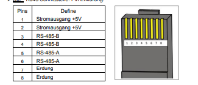

# EspEpeverController mit Webseite 
Esp8266 подключен к контроллеру заряда Epever Solar через модуль Rs485 и может считывать с него доступные данные, а также включать и выключать индикатор загрузку.

Прошивка (firmware_vX.X.X.X.bin") находится в каталоге esplasher.

Что может сделать контроллер ESP8266 Epever :

- Мигающий заголовок на веб-странице является символом -  все в порядке
- Он может выключать и включать реле нагрузку.
- Отображение всех доступных данных индикатора на веб-странице
- Передача с помощью Mqtt всех доступных данных трассировки в виде массива Json
- Передача через веб-интерфейс всех доступных данных трассировки в виде массива Json
- Отображение уровня сигнала Wi-Fi на веб-странице
- Реализация двойного сброса, чтобы вернуться на конфигурационный портал в собственной точке доступа Esp

Подключение:
- Адаптер ttl RS485 или XY-017
- подключите адаптер  A к A от Epever Rj45(контакт 5) и B к B  Epever Rj45 B (контакт 4)
- Остальное как на рисунке (можно использовать любой адаптер, а так же ESP8266 или WEMOS D1)
- подать питание на ESP

!Vcc составляет 3,3 вольта на обоих модулях!

##############################################################################################
- 1.Прошивка Esp8266
- 2.Перезапуск Esp
- 3.Поиск EPEVER_... по Wi-Fi
- 4.Подключение Wi-Fi, пароль 12345678
- 5.Он автоматически открывает окно браузера с 192.168.4.1
- 6.В разделе Конфигурация Выберите или введите Wi-Fi и введите пароль
- 7.Сохранить с помощью кнопки в самом низу
- 8.Перезапуск Esp
- 9.Поиск IP-адреса маршрутизаторе и подключение к модулю
#############################################################################################

